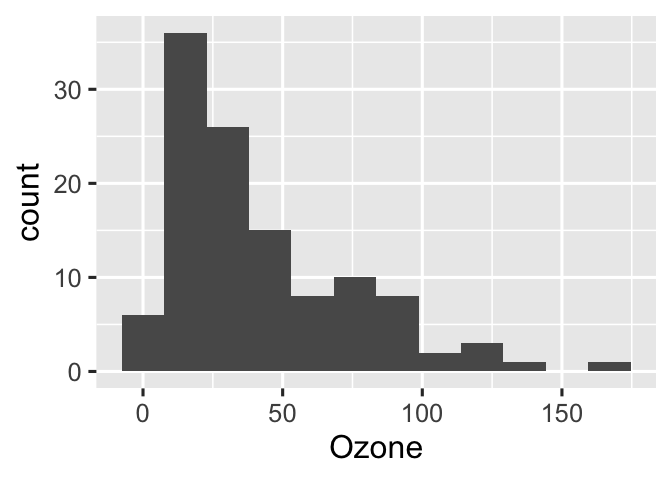

Chapter 3
================

Target Markdown is a powerful R Markdown interface for reproducible
analysis pipelines, and the chapter at
<https://books.ropensci.org/targets/markdown.html> walks through it in
detail. This R Markdown report the example from the chapter. Try it out
in both interactive and non-interactive modes, either by running the
code chunks in different ways or setting the `tar_interactive` chunk
option.

## Packages

The example requires several R packages, and `targets` must be version
0.5.0.9000 or above.

``` r
install.packages(c("biglm", "dplyr", "ggplot2", "readr", "targets", "tidyr"))
```

## Setup

If you are using old versions of `targets` (&lt;= 0.7.0) and/or `knitr`
(&lt;= 1.33), you will need to load the `targets` package in the R
Markdown document in order for Target Markdown code chunks to work.

``` r
library(targets)
#> Warning: package 'targets' was built under R version 4.1.2
```

Near the top of the document, you may also wish to remove the
`_targets_r` directory previously written by non-interactive runs of the
report. Otherwise, your pipeline may contain superfluous targets.

``` r
library(targets)
tar_unscript()
```

## Globals

We first define some global options/functions common to all targets. The
function below plots a histogram of ozone concentrations, and our
histogram target will need it.

``` r
options(tidyverse.quiet = TRUE)
tar_option_set(packages = c("biglm", "dplyr", "ggplot2", "readr", "tidyr"))
create_plot <- function(data) {
  ggplot(data) +
    geom_histogram(aes(x = Ozone), bins = 12) +
    theme_gray(24)
}
#> Establish _targets.R and _targets_r/globals/example-globals.R.
```

## Targets

Our first target borrows the `airquality` dataset built into base R.

``` r
tar_target(raw_data, airquality)
#> Establish _targets.R and _targets_r/targets/raw-data.R.
```

Our next targets preprocess the data, make a histogram, and fit a model.

``` r
list(
  tar_target(data, raw_data %>% filter(!is.na(Ozone))),
  tar_target(hist, create_plot(data))
)
#> Establish _targets.R and _targets_r/targets/downstream-targets.R.
```

Set the `tar_simple` chunk option to `TRUE` to define a single target
with the command in the code chunk. The chunk below only contains
`biglm(Ozone ~ Wind + Temp, data)` in the source, but because
`tar_simple` is `TRUE`, it is shorthand for
`tar_target(name = fit, command = biglm(Ozone ~ Wind + Temp, data))`.
All other arguments to `tar_target()` are set to their default values
(configurable with `tar_option_set()`).

``` r
tar_target(fit, {
  biglm(Ozone ~ -1 + Wind + Temp, data)
})
#> Define target fit from chunk code.
#> Establish _targets.R and _targets_r/targets/fit.R.
```

## Pipeline

If you ran all the `{targets}` chunks in non-interactive mode, then your
R scripts are set up to run the pipeline.

``` r
tar_make()
#> ✓ skip target raw_data
#> ✓ skip target data
#> ✓ skip target fit
#> ✓ skip target hist
#> ✓ skip pipeline
#> Warning message:
#> package ‘targets’ was built under R version 4.1.2
```

## Output

You can retrieve results from the `_targets/` data store using
`tar_read()` or `tar_load()`.

``` r
library(biglm)
tar_read(fit)
#> Large data regression model: biglm(Ozone ~ -1 + Wind + Temp, data)
#> Sample size =  116
```

``` r
tar_read(hist)
```

<!-- -->
